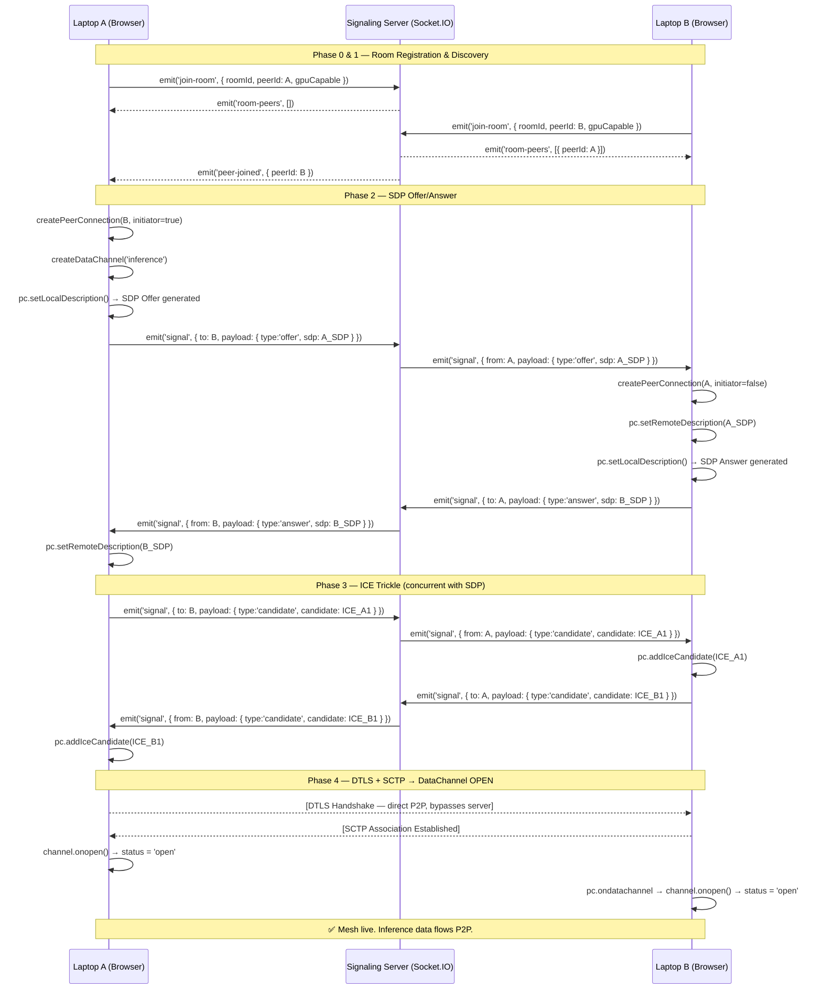

# TECHNICAL BLUEPRINT — green_compute_cluster
### IndiaNext 2026 Hackathon | Distributed Browser-Native LLM Inference

> **Execution Constraint:** 24-hour build. Every decision in this document is optimized for delivery speed, correctness, and demo-ability. Skip nothing marked **[CRITICAL]**.

---

## Table of Contents

1. [System Overview](#1-system-overview)
2. [Directory Structure](#2-directory-structure)
3. [Technology Stack & Pinned Versions](#3-technology-stack--pinned-versions)
4. [The React Hooks Architecture](#4-the-react-hooks-architecture)
5. [The WebRTC Handshake Lifecycle](#5-the-webrtc-handshake-lifecycle)
6. [RTCDataChannel Specification](#6-rtcdatachannel-specification)
7. [Agentic Swarm Protocol (Stretch Goal)](#7-agentic-swarm-protocol-stretch-goal)
8. [Signaling Server Implementation](#8-signaling-server-implementation)
9. [Deployment Architecture](#9-deployment-architecture)
10. [Build Order for 24-Hour Execution](#10-build-order-for-24-hour-execution)

---

## 1. System Overview

```
┌─────────────────────────────────────────────────────────────────────┐
│                     GREEN COMPUTE CLUSTER                           │
│                                                                     │
│  ┌──────────────┐    WebRTC DataChannel    ┌──────────────────┐    │
│  │  Laptop A    │◄────────────────────────►│    Laptop B      │    │
│  │  (Browser)   │                          │    (Browser)     │    │
│  │  WebGPU+LLM  │                          │    WebGPU+LLM    │    │
│  └──────┬───────┘                          └──────┬───────────┘    │
│         │  Socket.IO                              │  Socket.IO     │
│         │  (Signaling only)                       │                │
│         ▼                                         ▼                │
│  ┌──────────────────────────────────────────────────────────────┐  │
│  │          Node.js Signaling Server (Digital Ocean)            │  │
│  │          Caddy Reverse Proxy → wss://signal.yourdomain.com   │  │
│  └──────────────────────────────────────────────────────────────┘  │
└─────────────────────────────────────────────────────────────────────┘
```

**Core Design Principles:**
- The signaling server is **ephemeral plumbing only** — it never touches inference data.
- All compute, model weights, and LLM tokens flow exclusively over **WebRTC DataChannels** (encrypted DTLS 1.3).
- **WebLLM** (via `@mlc-ai/web-llm`) renders inference on the GPU via **WebGPU**. The CPU never sees a weight matrix.
- Cost at scale: **$0.00** for inference. Only the signaling server (< $6/month DO droplet) incurs cost.

---

## 2. Directory Structure

```
green_compute_cluster/
│
├── TECHNICAL_BLUEPRINT.md         ← this file
├── README.md
│
├── client/                        ← Vite + React frontend
│   ├── index.html
│   ├── vite.config.js
│   ├── package.json
│   │
│   ├── public/
│   │   └── favicon.ico
│   │
│   └── src/
│       ├── main.jsx               ← ReactDOM.createRoot entry
│       ├── App.jsx                ← Root component, composes all hooks
│       │
│       ├── hooks/                 ← [CRITICAL] All stateful logic lives here
│       │   ├── useSignaling.js    ← Socket.IO lifecycle, room management
│       │   ├── useWebRTC.js       ← Peer connections, ICE, DataChannels
│       │   └── useAgenticSwarm.js ← Task decomposition, routing (stretch)
│       │
│       ├── components/
│       │   ├── ClusterDashboard.jsx   ← Peer map, GPU stats, node health
│       │   ├── InferenceTerminal.jsx  ← Prompt input, streamed token output
│       │   ├── NodeCard.jsx           ← Per-peer GPU/latency display
│       │   └── SwarmLog.jsx           ← Agentic task routing log
│       │
│       ├── lib/
│       │   ├── webllm.js          ← WebLLM engine init & inference wrapper
│       │   ├── protocol.js        ← Message envelope schemas (serialize/parse)
│       │   └── constants.js       ← ICE servers, channel labels, timeouts
│       │
│       └── styles/
│           └── index.css
│
├── server/                        ← Node.js signaling server
│   ├── package.json
│   ├── index.js                   ← Express + Socket.IO entry point
│   └── rooms.js                   ← In-memory room/peer state manager
│
├── caddy/
│   └── Caddyfile                  ← Reverse proxy config for DO droplet
│
└── .env.example                   ← VITE_SIGNAL_URL, PORT
```

---

## 3. Technology Stack & Pinned Versions

| Layer | Package | Version | Rationale |
|---|---|---|---|
| Frontend Build | `vite` | `^5.4` | Native ESM, fastest HMR |
| UI | `react` | `^18.3` | Concurrent features for streaming tokens |
| Signaling Client | `socket.io-client` | `^4.7` | Matches server version exactly |
| LLM Inference | `@mlc-ai/web-llm` | `^0.2.78` | Stable WebGPU WASM backend |
| Signaling Server | `express` | `^4.19` | Minimal HTTP for health check |
| Signaling Server | `socket.io` | `^4.7` | Must match client minor version |
| Deployment | `caddy` | `v2` | Auto-TLS, zero-config WSS |
| Runtime | `node` | `>=20 LTS` | Native fetch, no polyfills |

**Model target:** `Llama-3.2-3B-Instruct-q4f16_1-MLC` — smallest capable model that fits in 4GB VRAM.

---

## 4. The React Hooks Architecture

### 4.1 `useSignaling.js` — Signaling Lifecycle Manager

**Single Responsibility:** Own the Socket.IO connection and translate server events into a reactive peer registry. It does **not** know anything about WebRTC.

```
State Owned:
  socketRef        → useRef(null)         raw socket instance
  peersRef         → useRef(new Map())    peerId → { socketId, joinedAt }
  roomId           → useState(null)       active room identifier
  connectionStatus → useState('idle')     'idle'|'connecting'|'connected'|'error'

Emits (to server):
  'join-room'      { roomId, peerId, gpuCapable }
  'signal'         { to: peerId, payload: { type, sdp | candidate } }
  'leave-room'     { roomId, peerId }

Listens (from server):
  'room-peers'     → seeds peersRef on initial join
  'peer-joined'    → adds to peersRef, triggers WebRTC initiation
  'peer-left'      → removes from peersRef, cleans up PC
  'signal'         → { from: peerId, payload } → forwarded to useWebRTC

Returns (public API):
  {
    socketRef,            // passed to useWebRTC so it can emit 'signal'
    peers,                // Map<peerId, peerMeta>
    roomId,
    connectionStatus,
    joinRoom(roomId),
    leaveRoom(),
    sendSignal(to, payload)  // thin wrapper: socket.emit('signal', ...)
  }
```

**Key implementation note:** Use `useRef` for the socket instance — never `useState`. Storing a mutable Socket.IO socket in React state causes re-render storms. Expose derived read-only state (like `connectionStatus`) via `useState` for reactivity.

---

### 4.2 `useWebRTC.js` — Peer Connection & DataChannel Mesh

**Single Responsibility:** Manage the full lifecycle of `RTCPeerConnection` objects and their associated `RTCDataChannel`s. Receive raw signaling payloads from `useSignaling` and produce usable DataChannels.

```
State Owned:
  peerConnections → useRef(new Map())   peerId → RTCPeerConnection
  dataChannels    → useRef(new Map())   peerId → RTCDataChannel
  channelStatus   → useState(new Map()) peerId → 'connecting'|'open'|'closed'
  makingOffer     → useRef(new Map())   peerId → boolean  (collision guard)

Configuration (from lib/constants.js):
  ICE_SERVERS: [
    { urls: 'stun:stun.l.google.com:19302' },
    { urls: 'stun:stun1.l.google.com:19302' }
  ]
  // Add TURN server credentials here for production reliability

Core Functions:

  createPeerConnection(peerId, isInitiator)
    → new RTCPeerConnection(ICE_CONFIG)
    → attach onicecandidate, onconnectionstatechange, ondatachannel
    → if isInitiator: createDataChannel(peerId)
    → store in peerConnections ref

  handleSignal(fromPeerId, payload)
    → payload.type === 'offer'     → handleOffer(fromPeerId, payload.sdp)
    → payload.type === 'answer'    → handleAnswer(fromPeerId, payload.sdp)
    → payload.type === 'candidate' → handleCandidate(fromPeerId, payload.candidate)

  sendToPeer(peerId, message)
    → dataChannels.get(peerId).send(JSON.stringify(message))
    → throws if channel not 'open'

  broadcastToPeers(message)
    → iterates all open dataChannels

Returns (public API):
  {
    channelStatus,        // reactive map for UI indicators
    sendToPeer,
    broadcastToPeers,
    handleSignal,         // called by useSignaling's onSignal handler
    closePeerConnection,
    openChannelCount      // derived: count of 'open' channels
  }
```

**[CRITICAL] Perfect Negotiation Pattern:** Implement the W3C "Perfect Negotiation" pattern to handle offer collisions gracefully when two peers attempt to initiate simultaneously:

```javascript
// Inside createPeerConnection:
pc.onnegotiationneeded = async () => {
  try {
    makingOffer.current.set(peerId, true);
    await pc.setLocalDescription();
    sendSignal(peerId, { type: pc.localDescription.type, sdp: pc.localDescription });
  } catch (err) {
    console.error(err);
  } finally {
    makingOffer.current.set(peerId, false);
  }
};

// Inside handleSignal for incoming offers:
const offerCollision =
  payload.type === 'offer' &&
  (makingOffer.current.get(fromPeerId) || pc.signalingState !== 'stable');

const isPolite = myPeerId > fromPeerId; // deterministic role assignment

if (offerCollision && !isPolite) return; // impolite peer ignores collision
if (offerCollision && isPolite) {
  await pc.setLocalDescription({ type: 'rollback' });
}
```

---

### 4.3 `useAgenticSwarm.js` — Task Decomposition & Routing (Stretch Goal)

**Single Responsibility:** Operate as the orchestration layer above the WebRTC mesh. Takes a user prompt, decomposes it into parallelizable sub-tasks, dispatches them to available peers, and reassembles the result stream.

```
State Owned:
  taskQueue     → useState([])      pending sub-tasks { id, prompt, assignee }
  taskResults   → useRef(new Map()) taskId → { chunk, done, peerId }
  swarmStatus   → useState('idle')  'idle'|'decomposing'|'routing'|'assembling'
  orchestratorId → useRef(null)     which peerId is the current orchestrator

Core Functions:

  submitPrompt(userPrompt)
    1. Decompose: split prompt into N subtasks (see §7 for strategy)
    2. Score available peers by latency (RTCDataChannel.bufferedAmount heuristic)
    3. Assign subtasks round-robin or by GPU score from peer capabilities
    4. Dispatch: sendToPeer(assignedPeerId, { type: 'TASK_ASSIGN', taskId, prompt })
    5. Await all TASK_RESULT envelopes
    6. Reassemble and stream final output to UI

  handleIncomingTask(fromPeerId, taskPayload)
    → Run local LLM inference via lib/webllm.js
    → Stream tokens back: sendToPeer(fromPeerId, { type: 'TASK_RESULT', taskId, token })
    → Send { type: 'TASK_DONE', taskId } when complete

  handleTaskResult(fromPeerId, resultPayload)
    → Append to taskResults
    → Check if all tasks done → trigger assembly

Returns:
  {
    submitPrompt,
    taskQueue,
    swarmStatus,
    assembledOutput,   // streamed string for InferenceTerminal
    swarmLog           // array of routing events for SwarmLog component
  }
```

---

## 5. The WebRTC Handshake Lifecycle

### Step-by-Step Technical Flow

```
Phase 0 — Room Registration (via Socket.IO)

  1. Laptop A loads the app → generates a UUID as `myPeerId`
  2. A calls joinRoom(roomId) → socket.emit('join-room', { roomId, peerId, gpuCapable: true })
  3. Server ACKs with 'room-peers': [] (empty room, A is first)

Phase 1 — Peer Discovery

  4. Laptop B loads app → joinRoom(same roomId)
  5. Server emits 'peer-joined' to ALL existing members (Laptop A)
  6. Server also emits 'room-peers': [{ peerId: A }] to Laptop B

Phase 2 — Offer/Answer Exchange (SDP)

  7. Laptop A (existing member) receives 'peer-joined' for B
     → A calls createPeerConnection(B.peerId, isInitiator=true)
     → A calls pc.createDataChannel('inference', channelConfig) → see §6
     → pc.onnegotiationneeded fires → A calls pc.setLocalDescription()
     → Browser generates SDP Offer (contains A's media capabilities, DTLS fingerprint)
     → A emits: socket.emit('signal', { to: B.peerId, payload: { type:'offer', sdp: A_SDP } })

  8. Server receives signal → routes it: socket.emit('signal', { from: A.peerId, payload })

  9. Laptop B receives signal from A
     → B calls createPeerConnection(A.peerId, isInitiator=false)
     → B calls pc.setRemoteDescription(A_SDP)
     → B calls pc.setLocalDescription()  ← browser auto-generates Answer SDP
     → B emits: socket.emit('signal', { to: A.peerId, payload: { type:'answer', sdp: B_SDP } })

 10. Laptop A receives answer → pc.setRemoteDescription(B_SDP)

Phase 3 — ICE Candidate Trickle

 11. As SDP exchange occurs, both browsers begin gathering ICE candidates
     (host candidates from local interfaces, srflx from STUN, relay from TURN)

 12. Each pc.onicecandidate = (event) => {
       if (event.candidate) {
         sendSignal(remotePeerId, { type: 'candidate', candidate: event.candidate })
       }
     }

 13. Remote peer receives 'candidate' signal
     → pc.addIceCandidate(new RTCIceCandidate(payload.candidate))

 14. ICE connectivity checks fire between peers (STUN binding requests/responses)
     → Best candidate pair selected (direct P2P preferred over TURN relay)

Phase 4 — DataChannel Open

 15. DTLS handshake completes over the selected ICE candidate pair
 16. SCTP association established over DTLS
 17. Laptop B's pc.ondatachannel = (event) → event.channel is the 'inference' channel
     → B attaches channel.onmessage, channel.onopen, channel.onerror
 18. channel.onopen fires on BOTH sides → channelStatus set to 'open'
 19. Mesh is live. Zero bytes have touched the signaling server during phases 3–19.
```

### Mermaid.js Sequence Diagram



---

## 6. RTCDataChannel Specification

### Channel Configuration

```javascript
// lib/constants.js
export const INFERENCE_CHANNEL_CONFIG = {
  label: 'inference',
  ordered: false,         // [CRITICAL] Unordered for lower latency
  maxRetransmits: 0,      // UDP-like semantics — no head-of-line blocking
  // DO NOT use maxPacketLifeTime with maxRetransmits simultaneously
};

export const CONTROL_CHANNEL_CONFIG = {
  label: 'control',
  ordered: true,          // Task assignments MUST arrive in order
  // reliable by default (no maxRetransmits / maxPacketLifeTime)
};
```

### Why Unordered + No Retransmits for Inference?

- **WebLLM streams tokens**, not a single blob. Individual token loss is acceptable — the UI can render partial output.
- SCTP's head-of-line blocking (when `ordered: true`) would stall token delivery if one 64KB fragment is lost — catastrophic for perceived UX.
- LLM inference data is **time-sensitive, not lossless critical**. Use the same philosophy as WebRTC video.

### ArrayBuffer Chunking Strategy

WebLLM model weights are stored in IndexedDB browser-side. The DataChannel is used for **inference requests and token responses**, not weight transfer. However, if implementing peer-assisted prefill, chunk large KV-cache buffers:

```javascript
// lib/protocol.js
const MAX_CHUNK_SIZE = 16 * 1024; // 16KB — safe below SCTP MTU fragmentation threshold

export function encodeMessage(type, payload) {
  const envelope = JSON.stringify({ type, payload, ts: Date.now() });
  return new TextEncoder().encode(envelope); // returns Uint8Array
}

export function chunkArrayBuffer(buffer, taskId) {
  const chunks = [];
  const total = Math.ceil(buffer.byteLength / MAX_CHUNK_SIZE);
  for (let i = 0; i < total; i++) {
    const chunk = buffer.slice(i * MAX_CHUNK_SIZE, (i + 1) * MAX_CHUNK_SIZE);
    chunks.push({ taskId, chunkIndex: i, totalChunks: total, data: chunk });
  }
  return chunks;
}
```

### Message Envelope Schema

All DataChannel messages are JSON-stringified envelopes. Define all types in `lib/protocol.js`:

```javascript
// Message Types (string enum)
export const MSG = {
  // Control plane
  PEER_CAPS:       'PEER_CAPS',       // { gpuVRAM, model, latencyMs }
  HEARTBEAT:       'HEARTBEAT',       // { ts }
  HEARTBEAT_ACK:   'HEARTBEAT_ACK',   // { ts, echoTs }

  // Agentic Swarm
  TASK_ASSIGN:     'TASK_ASSIGN',     // { taskId, subPrompt, contextWindow }
  TASK_RESULT:     'TASK_RESULT',     // { taskId, token }
  TASK_DONE:       'TASK_DONE',       // { taskId, fullText }
  TASK_REJECT:     'TASK_REJECT',     // { taskId, reason: 'busy'|'no-gpu' }

  // Inference streaming
  INFER_REQUEST:   'INFER_REQUEST',   // { requestId, prompt, maxTokens }
  INFER_TOKEN:     'INFER_TOKEN',     // { requestId, token }
  INFER_DONE:      'INFER_DONE',      // { requestId }
  INFER_ERROR:     'INFER_ERROR',     // { requestId, error }
};
```

---

## 7. Agentic Swarm Protocol (Stretch Goal)

### Architecture Pattern: Federated Map-Reduce

The orchestrating node (elected as the peer with lowest peerId lexicographically or by explicit UI action) executes a lightweight planning pass before dispatching tasks.

```
┌──────────────────────────────────────────────────────┐
│                  ORCHESTRATOR NODE                    │
│                                                       │
│  User Prompt                                         │
│       │                                              │
│       ▼                                              │
│  [1] DECOMPOSE                                       │
│  Split prompt into N independent sub-prompts         │
│  Strategy: delimit by logical sections or questions  │
│  e.g. "Compare X and Y and summarize Z" →            │
│       SubTask A: "Describe X in detail"               │
│       SubTask B: "Describe Y in detail"               │
│       SubTask C: (local) "Summarize [A_result, B]"   │
│                                                       │
│  [2] SCORE PEERS                                     │
│  Rank peers by: RTT (from HEARTBEAT), VRAM, idle     │
│                                                       │
│  [3] DISPATCH                                        │
│  sendToPeer(bestPeer, TASK_ASSIGN envelope)           │
│                                                       │
│  [4] COLLECT                                         │
│  Buffer TASK_RESULT tokens per taskId                 │
│  Timeout: 30s per task, fallback to local exec        │
│                                                       │
│  [5] ASSEMBLE                                        │
│  Concatenate results in original task order           │
│  Run final synthesis pass locally or on best peer     │
└──────────────────────────────────────────────────────┘
```

### Decomposition Strategy (MVP — No External LLM Required)

For hackathon execution speed, use **delimiter-based decomposition** rather than an LLM planner:

```javascript
// lib/swarm.js
export function decomposePrompt(prompt, peerCount) {
  const strategies = [
    // Strategy 1: Multi-question (detect '?' delimiters)
    () => prompt.split('?').filter(Boolean).map(q => q.trim() + '?'),

    // Strategy 2: Explicit list ("1. ... 2. ... 3. ...")
    () => prompt.match(/\d+\.\s+.+?(?=\d+\.|$)/gs)?.map(s => s.trim()),

    // Strategy 3: Sentence chunking (fallback)
    () => {
      const sentences = prompt.match(/[^.!?]+[.!?]+/g) || [prompt];
      const chunkSize = Math.ceil(sentences.length / peerCount);
      const chunks = [];
      for (let i = 0; i < sentences.length; i += chunkSize) {
        chunks.push(sentences.slice(i, i + chunkSize).join(' '));
      }
      return chunks;
    }
  ];

  for (const strategy of strategies) {
    const result = strategy();
    if (result && result.length > 1 && result.length <= peerCount + 1) {
      return result;
    }
  }
  return [prompt]; // No decomposition possible — run locally
}
```

### Task State Machine

```
PENDING → DISPATCHED → STREAMING → DONE
                ↓                    ↓
             TIMEOUT              ASSEMBLED
                ↓
           LOCAL_FALLBACK
```

### Peer Capability Advertisement

On `channel.onopen`, each peer immediately broadcasts its capabilities:

```javascript
sendToPeer(peerId, {
  type: MSG.PEER_CAPS,
  payload: {
    gpuVRAM: await getGPUInfo(),   // navigator.gpu adapter info
    model: ENGINE_MODEL_ID,
    loadedAt: Date.now(),
    maxConcurrent: 1,              // 1 inference at a time per node
  }
});
```

---

## 8. Signaling Server Implementation

### `server/index.js` — Core Structure

```javascript
import express from 'express';
import { createServer } from 'node:http';
import { Server } from 'socket.io';
import { RoomManager } from './rooms.js';

const app = express();
const httpServer = createServer(app);
const io = new Server(httpServer, {
  cors: { origin: process.env.CLIENT_ORIGIN || '*', methods: ['GET','POST'] },
  transports: ['websocket'],   // skip long-polling — we want WS only
});

const rooms = new RoomManager();

app.get('/health', (_, res) => res.json({ status: 'ok', rooms: rooms.size() }));

io.on('connection', (socket) => {
  console.log(`[+] Peer connected: ${socket.id}`);

  socket.on('join-room', ({ roomId, peerId, gpuCapable }) => {
    const existingPeers = rooms.join(roomId, peerId, socket.id, gpuCapable);

    // Send existing peers to the new joiner
    socket.emit('room-peers', existingPeers);

    // Notify existing peers of the new joiner
    socket.to(roomId).emit('peer-joined', { peerId, gpuCapable });

    socket.join(roomId);
    socket.data = { roomId, peerId };
    console.log(`[room:${roomId}] ${peerId} joined. Total: ${existingPeers.length + 1}`);
  });

  // Pure relay — server never inspects the SDP/ICE payload
  socket.on('signal', ({ to, payload }) => {
    const targetSocketId = rooms.getSocketId(socket.data.roomId, to);
    if (targetSocketId) {
      io.to(targetSocketId).emit('signal', {
        from: socket.data.peerId,
        payload,
      });
    }
  });

  socket.on('disconnect', () => {
    const { roomId, peerId } = socket.data ?? {};
    if (roomId && peerId) {
      rooms.leave(roomId, peerId);
      socket.to(roomId).emit('peer-left', { peerId });
      console.log(`[-] ${peerId} left room ${roomId}`);
    }
  });
});

httpServer.listen(process.env.PORT || 3001, () => {
  console.log(`Signaling server on :${process.env.PORT || 3001}`);
});
```

### `server/rooms.js` — In-Memory State

```javascript
export class RoomManager {
  #rooms = new Map(); // roomId → Map<peerId, { socketId, gpuCapable, joinedAt }>

  join(roomId, peerId, socketId, gpuCapable) {
    if (!this.#rooms.has(roomId)) this.#rooms.set(roomId, new Map());
    const room = this.#rooms.get(roomId);
    const existing = [...room.entries()].map(([id, meta]) => ({ peerId: id, ...meta }));
    room.set(peerId, { socketId, gpuCapable, joinedAt: Date.now() });
    return existing;
  }

  leave(roomId, peerId) {
    this.#rooms.get(roomId)?.delete(peerId);
    if (this.#rooms.get(roomId)?.size === 0) this.#rooms.delete(roomId);
  }

  getSocketId(roomId, peerId) {
    return this.#rooms.get(roomId)?.get(peerId)?.socketId ?? null;
  }

  size() {
    return this.#rooms.size;
  }
}
```

---

## 9. Deployment Architecture

### Caddy Configuration (`caddy/Caddyfile`)

```caddyfile
signal.yourdomain.com {
    reverse_proxy localhost:3001

    # WebSocket upgrade headers are handled automatically by Caddy
    # TLS certificates are provisioned automatically via Let's Encrypt
}
```

### Digital Ocean Setup (One-time, ~15 min)

```bash
# On the DO droplet (Ubuntu 22.04 LTS, $6/mo Basic)
# 1. Install Caddy
sudo apt install -y caddy

# 2. Install Node.js 20 LTS
curl -fsSL https://deb.nodesource.com/setup_20.x | sudo -E bash -
sudo apt install -y nodejs

# 3. Install PM2 for process management
sudo npm install -g pm2

# 4. Deploy server
cd /opt/green-cluster-server
npm install
pm2 start index.js --name green-cluster-signal
pm2 startup && pm2 save

# 5. Configure Caddy
sudo cp /path/to/Caddyfile /etc/caddy/Caddyfile
sudo systemctl reload caddy
```

### Client Environment Variables

```bash
# client/.env
VITE_SIGNAL_URL=wss://signal.yourdomain.com
VITE_DEFAULT_ROOM=hackathon-demo
VITE_ENGINE_MODEL=Llama-3.2-3B-Instruct-q4f16_1-MLC
```

---

## 10. Build Order for 24-Hour Execution

### Hour 0–2: Foundation
- [ ] `git init`, create directory structure per §2
- [ ] `npm create vite@latest client -- --template react`
- [ ] `server/package.json`, install deps
- [ ] Write `lib/constants.js` and `lib/protocol.js`
- [ ] Deploy signaling server to DO, verify `/health` endpoint

### Hour 2–5: Signaling Layer
- [ ] Implement `useSignaling.js` completely
- [ ] Smoke test with two browser tabs: confirm `peer-joined` fires
- [ ] Implement `server/rooms.js` with full leave/cleanup logic

### Hour 5–9: WebRTC Mesh
- [ ] Implement `useWebRTC.js` with Perfect Negotiation pattern
- [ ] Verify `channel.onopen` fires in both browsers (Chrome DevTools → `chrome://webrtc-internals`)
- [ ] Implement `sendToPeer` / `broadcastToPeers`
- [ ] Implement `HEARTBEAT` / `HEARTBEAT_ACK` for latency measurement

### Hour 9–13: WebLLM Integration
- [ ] Implement `lib/webllm.js` — load engine, expose `generate(prompt, onToken)`
- [ ] Wire `INFER_REQUEST` → local WebLLM → stream `INFER_TOKEN` back over DataChannel
- [ ] Build `InferenceTerminal.jsx` — renders streamed tokens in real-time

### Hour 13–17: UI & Cluster Dashboard
- [ ] Build `ClusterDashboard.jsx` — live peer map, channel status indicators
- [ ] Build `NodeCard.jsx` — GPU VRAM bar, RTT latency, model loaded indicator
- [ ] Polish with TailwindCSS or minimal CSS

### Hour 17–21: Agentic Swarm (Stretch Goal)
- [ ] Implement `useAgenticSwarm.js` decomposition + dispatch
- [ ] Implement `TASK_ASSIGN` handler on worker peers
- [ ] Build `SwarmLog.jsx` — real-time routing event log

### Hour 21–24: Integration, Testing, Demo Prep
- [ ] End-to-end test: 3 laptops, one prompt, parallel inference
- [ ] Record a fallback demo video in case of live demo failure
- [ ] Prepare 2-minute pitch: "zero cost, browser native, P2P encrypted inference"

---

## Critical Gotchas

| Gotcha | Mitigation |
|---|---|
| WebGPU not available on Firefox / Safari | Enforce Chrome 113+ in UI; show browser check on load |
| TURN server needed in corporate/NAT environments | Add free Metered.ca TURN credentials to ICE config |
| WebLLM model download is 2–4GB first load | Cache in Origin Private File System (OPFS) — WebLLM does this automatically |
| `ordered: false` DataChannel drops on poor WiFi | Keep control channel `ordered: true`; only inference uses unordered |
| Socket.IO version mismatch client/server | Pin to identical minor: `"socket.io": "4.7.5"` in both `package.json` |
| React StrictMode double-invokes effects | Wrap socket init in a ref-guard or disable StrictMode for dev |
| Large SDP causes Socket.IO message drop | SDP is ~2KB max — safely within Socket.IO 1MB default frame limit |

---

*Blueprint version: 1.0.0 | Generated: 2026-03-16 | IndiaNext Hackathon*
